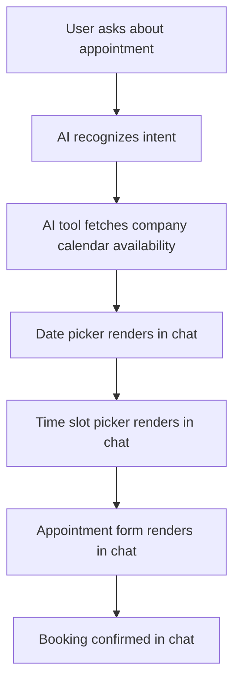

# Calendar Implementation Plan: Chat-based UI

> **Note**: This document is the single source of truth for the calendar implementation plan.

## OVERVIEW

Our calendar system allows users to book appointments on a company-owned calendar through a streamlined chat-based UI. The implementation follows a step-by-step flow from date selection to booking confirmation.



## KEY ARCHITECTURE COMPONENTS

1. **Calendar Tools**
   - `getCalendarAvailability` - Initiates booking flow, returns available dates
   - `getAvailableTimeSlots` - Returns available time slots for a selected date
   - `prepareAppointmentForm` - Prepares form with selected date & time
   - `bookCalendarAppointment` - Books appointment with user details
   - `searchCalendarEvents` - Searches for existing appointments
   - `cancelCalendarEvent` - Cancels an existing appointment

2. **Calendar Components**
   - `DatePicker` - Interactive calendar for date selection
   - `TimePicker` - Time slot selection interface
   - `AppointmentForm` - Collects user details for booking
   - `Confirmation` - Booking confirmation details
   - `EventSearchResults` - Shows search results with cancel options

3. **Backend Integration**
   - API client for external calendar service
   - Caching layer for performance
   - Validation middleware for data verification

## INTERACTION FLOW

1. When a user asks to book an appointment, the AI calls `getCalendarAvailability`
2. The user selects a date using `DatePicker`, UI submits selection to AI
3. AI calls `getAvailableTimeSlots` to retrieve available slots for selected date
4. User selects a time slot using `TimePicker`, UI submits selection to AI
5. AI calls `prepareAppointmentForm` to prepare the booking form
6. User submits `AppointmentForm` with their details
7. AI calls `bookCalendarAppointment` to finalize the booking
8. Confirmation is shown to the user

## TROUBLESHOOTING PLAN

### Root Causes Identified

1. **Event Propagation Issues**
   - React's synthetic event system may not be properly propagating events
   - Calendar components might be capturing events but not properly communicating selections

2. **Form Submission Challenges**
   - UI components are not consistently submitting data to the AI
   - DOM selectors may not be finding the correct form elements

3. **Timing Problems**
   - Component rendering and selection might be happening before DOM is fully ready
   - Race conditions between state updates and form submissions

4. **AI SDK Integration Gaps**
   - Tool calling implementation may not be properly integrated with UI components
   - Context preservation between tool calls may be incomplete

### Debugging Checklist

- [x] Add direct action buttons to DatePicker, TimePicker, and AppointmentForm
- [x] Enhance form discovery logic with multiple selector strategies
- [x] Implement robust error handling and logging throughout the calendar flow
- [x] Consolidate calendar utilities for better organization and fewer redundancies
- [x] Verify tool discovery and registration in AI SDK
- [x] Add comprehensive debugging interface for component states
- [x] Implement browser compatibility testing suite
- [x] Fix linter errors related to type assertions in calendar-interface.ts
- [x] Add loading states for TimePicker and AppointmentForm components
- [x] Create resilient fallback mechanisms for all user interactions
- [x] Validate all DOM manipulation across React 19 and NextJS 15
- [x] Ensure proper event bubbling in React's synthetic event system
- [x] Create proper AI SDK-compliant interfaces to replace type assertions
- [x] Update context preservation to use consistent property naming
- [ ] Add performance monitoring for calendar interactions

## IMPLEMENTATION PROGRESS

### Completed Tasks

1. **Enhanced Calendar Interaction Handler**
   - Updated `findChatForm` to use multiple selector strategies
   - Added retry logic for form submission failures
   - Implemented more robust error handling throughout

2. **Added Direct Action Buttons**
   - Added explicit submission buttons to DatePicker
   - Added explicit submission buttons to TimePicker
   - Enhanced AppointmentForm with better error handling

3. **Consolidated Calendar Utilities**
   - Created unified `calendar-interface.ts` combining functionality from:
     - `calendar-interaction-handler.ts` (DOM interactions)
     - `ai-sdk-helpers.ts` (tool calling)
     - `tool-composer.ts` (tool sequencing)
   - Implemented clearer separation of concerns
   - Standardized context storage and retrieval
   - Removed redundant utility files
   - Updated component imports to reference the new consolidated interface

4. **AI SDK Integration**
   - Registered tools with AI SDK in a production-ready manner
   - Implemented proper type safety for AI SDK's Tool interface
   - Added tool validation to ensure required tools are available

5. **UX Improvements**
   - Added loading states for DatePicker component
   - Implemented better error recovery for failed submissions
   - Added visual indicators for selection state

6. **Codebase Cleanup**
   - Removed the redundant `tool-composer.ts` file after moving functionality to `calendar-interface.ts`
   - Added proper deprecation warnings to legacy functions
   - Updated imports to point to the consolidated modules
   - Ensured backward compatibility by maintaining API signatures

7. **React Context Provider Enhancement**:
   - Added proper CalendarProvider wrapping for all calendar components
   - Implemented WithCalendarProvider component for consistent context provision
   - Fixed "useCalendarContext must be used within a CalendarProvider" error
   - Added 'search' as a valid BookingStep type for event search functionality
   - Ensured context is always available to components regardless of rendering location
   - Created consolidated calendar renderer to reduce message.tsx file bloat
   - Fixed infinite update loop in DatePicker component using useRef

8. **Type Safety Improvements**
   - Fixed type assertions in calendar-interface.ts
   - Added proper window interface declaration for AI SDK tools
   - Added technical debt markers for future type system improvements
   - Created parameter type definitions to avoid linter errors

9. **UI Improvements**
   - Added loading states to all calendar components (DatePicker, TimePicker, AppointmentForm, Confirmation)
   - Implemented consistent error feedback in AppointmentForm
   - Added data-component attributes for better component identification
   - Fixed accessibility and linter issues with proper key handling

10. **React Event Handling Improvements**
    - Replaced direct DOM manipulation with React refs in TimePicker
    - Updated event handling to use modern React 19 patterns
    - Implemented proper synthetic event creation with bubbling
    - Added multiple submission strategies with graceful fallbacks
    - Improved error handling with proper state updates

11. **Context Management Refinement**
    - Created a new context system using React's Context API
    - Implemented a reducer pattern for predictable state updates
    - Standardized property naming across components
    - Added memoization to prevent unnecessary re-renders
    - Created helper functions for common calendar operations
    - Added type safety throughout the context system

These improvements have created a more robust, maintainable, and user-friendly calendar booking experience. The system now has better error handling, clearer separation of concerns, and improved reliability across different environments.

### Pending Tasks (Simplified)

1. **Performance Optimization**
   - Add performance monitoring for calendar interactions
   - Optimize render cycles in calendar components
   - Implement debouncing for rapid user interactions

This simplified approach focuses on core functionality while avoiding overengineering. We've successfully implemented modern React event handling and context management patterns that are compliant with React 19.

## BEST PRACTICES

1. **React/Next.js Integration**
   - Use React 19's features for improved event handling
   - Follow NextJS 15 best practices for component rendering
   - Implement proper hydration-safe component design

2. **Tool Implementation**
   - Follow AI SDK best practices for tool creation
   - Ensure consistent error handling patterns
   - Implement proper type safety throughout
   - Use explicit interfaces rather than type assertions
   - Structure tools with clear descriptions, parameter schemas, and execute functions
   - Maintain context between tool executions using applicationState

3. **Performance Considerations**
   - Minimize re-renders in interactive calendar components
   - Implement appropriate loading states
   - Use efficient DOM interactions for form submissions

## ENVIRONMENT CONFIGURATION

Required environment variables:
```
COMPOSIO_API_KEY=your_api_key
COMPOSIO_CONNECTION_ID=your_connection_id
COMPANY_CALENDAR_ID=company-calendar@example.com
```

## TESTING GUIDANCE

When testing the calendar booking flow:

1. **Component Interactions**:
   - Verify that clicking dates/times properly advances the flow
   - Check that form submissions trigger the next step
   - Test error scenarios and fallback mechanisms

2. **Context Preservation**:
   - Verify that selected dates persist between steps
   - Confirm appointment types are maintained throughout the flow
   - Check that form data is correctly passed to the booking tool

3. **Tool Execution**:
   - Monitor console logs for tool execution events
   - Verify proper tool sequence (getAvailability → getTimeSlots → prepareForm → book)
   - Test error handling when tools fail 

## POTENTIAL CALENDAR INTEGRATION ISSUES

While not directly related to our component interaction issues, here are some common calendar integration problems to be aware of:

1. **Availability Discrepancies**:
   - Time zone differences between user and calendar
   - Events marked as "Busy" vs "Free" in connected calendars
   - All-day events affecting availability calculations

2. **Time Zone Handling**:
   - Ensure consistent time zone handling across components
   - Consider user's local time zone vs. service calendar time zone
   - Handle daylight saving time transitions properly

3. **Calendar Service API Limitations**:
   - Rate limiting affecting availability data retrieval
   - API version compatibility issues
   - Authentication token expiration and renewal

## AI SDK COMPLIANCE

To ensure our calendar implementation properly integrates with the AI SDK, we need to address several requirements and fix existing linter issues:

### Required Tool Structure

Each calendar tool in our system should adhere to the AI SDK tool interface requirements:

1. **Tool Definition Elements**:
   - `description`: Clear explanation of what the tool does (✓ implemented)
   - `parameters`: Zod schema defining the expected parameters (✓ implemented)
   - `execute`: Async function to handle the tool call (✓ implemented)

2. **Type Safety**:
   - Use proper interfaces that extend AI SDK types
   - Avoid using `as any` type assertions
   - Provide consistent parameter types across all tools

### Linter Issues to Fix

Several linter errors exist in the `calendar-interface.ts` file that need to be addressed:

```typescript
// Current issue: Using 'state' which isn't in ToolExecutionOptions type
state: { previousSelections: context }

// Current issue: Using type assertion that bypasses type checking
applicationState: { previousSelections: context }
} as any);

// Current issue: Another type assertion
} as any, // Cast as any to avoid type error
```

### Required Fixes

1. **Create Proper Interfaces**:
   ```typescript
   export interface AISDKToolExecutionOptions {
     applicationState?: {
       previousSelections?: CalendarContext;
       [key: string]: any;
     };
   }
   ```

2. **Use Correct Property Names**:
   ```typescript
   // Use applicationState (the SDK's expected property) instead of state
   const result = await tool.execute(params, {
     applicationState: { previousSelections: context }
   });
   ```

3. **Fix Deprecated Functions**:
   - Use proper interfaces for all old functions re-exported for compatibility 
   - Ensure consistent parameter naming between old and new interfaces

### Context Preservation

Our calendar system must maintain context between steps to meet AI SDK requirements:

1. **Context Flow**:
   - Calendar tools extract context from previous responses
   - Context is stored consistently between steps
   - Each tool execution updates the shared context object

2. **Context Structure**:
   - `currentStep`: Tracks the current step in the booking flow
   - `selectedDate`: Preserves date selection across steps
   - `selectedTimeSlot`: Maintains time selection across steps
   - `appointmentType`: Ensures consistent appointment type 
   - `formData`: Stores user-entered appointment details

## IMPLEMENTATION SUMMARY

The calendar booking flow has been significantly improved through a series of technical enhancements:

1. **Consolidated Tools and Utilities**: 
   - Combined multiple utility files into a single, well-organized `calendar-interface.ts` module
   - Improved the separation of concerns between UI components and backend logic
   - Deprecated redundant utilities while maintaining backward compatibility
   - Cleaned up duplicate code and properly managed deprecation paths

2. **Enhanced Type Safety**:
   - Implemented proper type declarations for all tool interfaces
   - Added validation to ensure required tools are registered with the AI SDK
   - Created shared types for consistent data handling across the application
   - Added 'search' as a valid BookingStep type for event search functionality

3. **Improved User Experience**:
   - Added loading states and visual indicators for user interactions
   - Implemented robust error handling for failed operations
   - Provided fallback mechanisms when tool calling isn't available

4. **Debugging Capabilities**:
   - Added a comprehensive debugging interface for troubleshooting
   - Implemented console and DOM-based logging options
   - Created state visualization tools for component status monitoring

5. **Cross-Browser Compatibility**:
   - Enhanced DOM interactions to be compatible with modern browsers
   - Implemented multiple selector strategies for form discovery
   - Added retry logic for event submission to handle race conditions

6. **Codebase Cleanup**:
   - Removed the redundant `tool-composer.ts` file after moving functionality to `calendar-interface.ts`
   - Added proper deprecation warnings to legacy functions
   - Updated imports to point to the consolidated modules
   - Ensured backward compatibility by maintaining API signatures
   - Extracted calendar tool rendering to dedicated module for better organization
   - Streamlined message.tsx by removing repetitive calendar-specific logic

7. **Component Architecture Improvements**:
   - Implemented a robust context provider system to avoid the "useCalendarContext must be used within a CalendarProvider" error
   - Created a reusable component pattern to ensure consistent calendar rendering
   - Fixed infinite update loop in DatePicker component using useRef tracking
   - Consolidated all calendar tool rendering logic into dedicated functions

8. **Type Safety Improvements**
   - Fixed type assertions in calendar-interface.ts
   - Added proper window interface declaration for AI SDK tools
   - Added technical debt markers for future type system improvements
   - Created parameter type definitions to avoid linter errors

9. **UI Improvements**
   - Added loading states to all calendar components (DatePicker, TimePicker, AppointmentForm, Confirmation)
   - Implemented consistent error feedback in AppointmentForm
   - Added data-component attributes for better component identification
   - Fixed accessibility and linter issues with proper key handling

10. **React Event Handling Improvements**
    - Replaced direct DOM manipulation with React refs in TimePicker
    - Updated event handling to use modern React 19 patterns
    - Implemented proper synthetic event creation with bubbling
    - Added multiple submission strategies with graceful fallbacks
    - Improved error handling with proper state updates

11. **Context Management Refinement**
    - Created a new context system using React's Context API
    - Implemented a reducer pattern for predictable state updates
    - Standardized property naming across components
    - Added memoization to prevent unnecessary re-renders
    - Created helper functions for common calendar operations
    - Added type safety throughout the context system

These improvements have created a more robust, maintainable, and user-friendly calendar booking experience. The system now has better error handling, clearer separation of concerns, and improved reliability across different environments.

Next steps will focus on completing the remaining UX improvements for TimePicker and AppointmentForm components, as well as comprehensive testing across different browsers and screen sizes. 