# Calendar Refactoring Plan: From Artifact to Chat UI

> **Note**: This document is the single source of truth for the calendar implementation plan. Previous documentation (README-calendar-ui.md and docs/calendar-setup.md) has been consolidated into this plan.

## IMPLEMENTATION GUIDE FOR LLM/AI

This document provides a clear roadmap for refactoring our calendar scheduling functionality from the current artifact-based implementation to a chat-based UI. This guide is optimized for AI assistants to understand the plan, locate relevant files, and implement the changes step by step.

---

## OVERVIEW

We're transitioning from our current artifact-based calendar implementation to a simplified chat-based UI that allows users to book appointments on a company-owned calendar (not user-specific calendars).

```mermaid
graph TD
    A[Current: Artifact-based Calendar] --> |Transition| B[Target: Chat-based Calendar]
    
    subgraph "Current Implementation"
    A1[User asks about calendar] --> A2[AI creates calendar artifact]
    A2 --> A3[Date selection in artifact]
    A3 --> A4[Time selection in artifact]
    A4 --> A5[Form completion in artifact]
    A5 --> A6[Google Calendar integration]
    end
    
    subgraph "Target Implementation"
    B1[User asks about appointment] --> B2[AI recognizes intent]
    B2 --> B3[AI tool fetches company calendar availability]
    B3 --> B4[Simple date picker renders in chat]
    B4 --> B5[Simple time slot picker renders in chat]
    B5 --> B6[Appointment type selection in chat]
    B6 --> B7[Basic form completion in chat]
    end
```



---

## KEY DIFFERENCES

1. **Company-owned calendar** instead of user-specific calendars
2. **No user OAuth flow** needed (service account authentication)
3. **Pre-defined appointment types** with standard durations
4. **Simple UI components** rendered directly in chat
5. **Composio integration** for Google Calendar operations

---

## COMPOSIO INTEGRATION

We've integrated Composio to handle calendar operations using their Google Calendar integration. This provides a robust set of tools for managing appointments and calendar availability.

### Composio Setup

- **API Key**: Stored in environment variable `COMPOSIO_API_KEY`
- **Connection ID**: Stored in environment variable `COMPOSIO_CONNECTION_ID`
- **Company Calendar ID**: Stored in environment variable `COMPANY_CALENDAR_ID`

### Key Calendar Actions

Organized by use case:

**Availability Management:**
- `GOOGLECALENDAR_FIND_FREE_SLOTS` - Find available time slots for booking
- `GOOGLECALENDAR_GET_CURRENT_DATE_TIME` - Get current date/time in specific timezone

**Event Management:**
- `GOOGLECALENDAR_CREATE_EVENT` - Create new appointments
- `GOOGLECALENDAR_UPDATE_EVENT` - Modify existing appointments
- `GOOGLECALENDAR_DELETE_EVENT` - Cancel appointments
- `GOOGLECALENDAR_QUICK_ADD_EVENT` - Create events from text descriptions (fallback)
- `GOOGLECALENDAR_REMOVE_ATTENDEE` - Remove attendees from events

**Calendar Management:**
- `GOOGLECALENDAR_LIST_CALENDARS` - Get list of available calendars
- `GOOGLECALENDAR_FETCH_CALENDAR` - Get details of a specific calendar
- `GOOGLECALENDAR_PATCH_CALENDAR` - Update calendar settings
- `GOOGLECALENDAR_DUPLICATE_CALENDAR` - Create calendar copies

**Event Search/Retrieval:**
- `GOOGLECALENDAR_FIND_EVENT` - Search for existing events

### Implementation Strategy

When implementing Composio calendar actions, follow these guidelines:

1. **Abstraction Layer**: Create wrapper functions in `/lib/ai/tools/calendar-tools.ts` that encapsulate the Composio API calls. This makes it easier to change the implementation details without affecting the rest of the codebase.

2. **Error Handling**: Always implement robust error handling for each Composio action, including fallbacks for when the API fails.

3. **Timezone Management**: Be consistent with timezone handling. Use the `GOOGLECALENDAR_GET_CURRENT_DATE_TIME` action when needed to ensure time calculations are correct.

4. **Parameter Validation**: Validate all parameters before sending them to Composio to avoid API errors.

5. **Cache Results**: For frequently called operations like `FIND_FREE_SLOTS`, consider implementing caching to reduce API calls.

6. **UI Feedback**: Provide clear loading states and error messages in the UI components that rely on these actions.

For detailed API schemas and parameters for each action, refer to the `docs/guides/features/GoogleCal-Composio-Docs.md` file, which contains comprehensive documentation for all Composio calendar operations.

---

## REFERENCE DOCUMENTATION

For implementing this plan, refer to these key documents:
- `docs/guides/ai-sdk-llm.md` - AI SDK integration and tool creation
- `docs/guides/mcp-llm.md` - Model Context Protocol support
- `docs/guides/features/GoogleCal-Composio-Docs.md` - Google Calendar API details
- `docs/guides/features/Composio-Docs.md` - Composio integration

---

## CURRENT TECH STACK & FILE LOCATIONS

### Key Files in Current Implementation

- **Core Calendar Integration**:
  - `/lib/composio/calendar.ts`: Service account authentication
  - `/lib/composio/config.ts`: Composio configuration and toolset setup
  - `/lib/calendar/types.ts`: Centralized type definitions
  - `/lib/ai/tools/calendar-tools.ts`: AI tools for calendar operations
  - `/lib/ai/tools/index.ts`: Tool exports

- **UI Components**:
  - `/components/calendar/DatePicker.tsx`: Date selection component
  - `/components/calendar/TimePicker.tsx`: Time slot selection component
  - `/components/calendar/AppointmentForm.tsx`: Booking form component
  - `/components/calendar/Confirmation.tsx`: Confirmation component
  - `/components/calendar/index.ts`: Component exports

- **Message Integration**:
  - `/components/message.tsx`: Tool invocation handling

---

## IMPLEMENTATION CHECKLIST

- [x] Phase 1: Core Calendar Integration
  - [x] 1.1: Set up company calendar authentication with Composio
  - [x] 1.2: Create calendar availability tool
  - [x] 1.3: Create calendar booking tool
  - [x] 1.4: Disable current calendar artifact
- [x] Phase 2: Chat UI Components
  - [x] 2.1: Create simple date picker component
  - [x] 2.2: Create simple time slot picker component
  - [x] 2.3: Create appointment form component
  - [x] 2.4: Integrate components with chat UI
- [x] Phase 3: Cleanup and Organization
  - [x] 3.1: Consolidate calendar components
  - [x] 3.2: Centralize calendar type definitions
  - [x] 3.3: Update import paths
  - [x] 3.4: Remove redundant code
- [ ] Phase 4: Enhanced Composio Integration
  - [ ] 4.1: Implement event search functionality
  - [ ] 4.2: Add event management tools (update/delete/reschedule)
  - [ ] 4.3: Create calendar management utilities
  - [ ] 4.4: Improve error handling for Composio actions

---

## IMPLEMENTATION PROGRESS

### Phase 1: Core Calendar Integration (Completed)

✅ **1.1: Set Up Company Calendar Authentication**
- Created `/lib/composio/calendar.ts` for service account auth
- Implemented calendar toolset functions
- Added utility functions for time conversion and slot processing

✅ **1.2 & 1.3: Create Calendar Tools**
- Implemented four tools in `/lib/ai/tools/calendar-tools.ts`:
  - `getCalendarAvailability`: Initial appointment type selection
  - `getAvailableTimeSlots`: Shows time slots for a date
  - `prepareAppointmentForm`: Sets up form for booking details
  - `bookCalendarAppointment`: Creates the calendar event

✅ **1.4: Disable Current Calendar Artifact**
- Modified `/components/artifact.tsx` to remove calendar
- Updated `/lib/artifacts/registry.ts` to remove calendar
- Removed legacy `client.tsx` and `server.ts` from artifacts/calendar directory

### Phase 2: Chat UI Components (Completed)

✅ **2.1 - 2.4: Chat UI Components**
- Implemented UI components in `/components/calendar/`
- Updated `/components/message.tsx` to handle calendar tool results
- Added appropriate prompts in `/lib/ai/prompts.ts`
- Configured route handler in `/app/(chat)/api/chat/route.ts`

### Phase 3: Cleanup and Organization (Completed)

✅ **3.1: Consolidate Calendar Components**
- Migrated components from `/artifacts/calendar/components/` to `/components/calendar/`
- Improved components with shadcn/ui styling and accessibility

✅ **3.2: Centralize Type Definitions**
- Created `/lib/calendar/types.ts` for all calendar type definitions
- Updated components and tools to use centralized types

✅ **3.3: Update Import Paths**
- Updated `message.tsx` to import from consolidated location
- Created proper export from `/components/calendar/index.ts`

✅ **3.4: Remove Redundant Code**
- Removed duplicate Simple* components
- Removed old components from `/artifacts/calendar/components/`
- Deleted obsolete `client.tsx` and `server.ts` files
- Fixed linter errors in message component
- Updated documentation to reflect changes
- Updated analysis.md with new directory structure

### Phase 4: Enhanced Composio Integration (Planned)

⬜ **4.1: Implement Event Search Functionality**
- Create `searchCalendarEvents` tool using `GOOGLECALENDAR_FIND_EVENT`
- Add UI components for displaying search results
- Integrate with chat conversation flow

⬜ **4.2: Add Event Management Tools**
- Implement `updateCalendarEvent` using `GOOGLECALENDAR_UPDATE_EVENT`
- Implement `cancelCalendarEvent` using `GOOGLECALENDAR_DELETE_EVENT`
- Create UIs for confirming these actions

⬜ **4.3: Create Calendar Management Utilities**
- Add `listCalendars` tool using `GOOGLECALENDAR_LIST_CALENDARS`
- Implement utilities for calendar selection and display

⬜ **4.4: Improve Error Handling**
- Enhance error handling for all Composio actions
- Add fallback mechanisms for API failures
- Improve user feedback on API errors

---

## ENVIRONMENT CONFIGURATION

Required environment variables:
```
COMPOSIO_API_KEY=your_api_key
COMPOSIO_CONNECTION_ID=your_connection_id
COMPANY_CALENDAR_ID=company-calendar@example.com
```

---

## FINAL CLEANUP

✅ Completed final cleanup tasks:
1. ✅ Documented the new implementation in README.md
2. ✅ Removed all redundant components and files
3. ✅ Deleted obsolete server implementations

Remaining tasks:
1. Create a PR with all changes
2. Add unit and integration tests for the new implementation
3. Implement enhanced Composio features (Phase 4)

---

## TECHNICAL DEBT CONSIDERATIONS

1. **Error handling improvements**:
   - Add more robust error handling for calendar API failures
   - Implement fallback options when availability data can't be fetched

2. **Performance optimizations**:
   - Cache availability data for repeated requests
   - Optimize component rendering

3. **Accessibility**:
   - Ensure all calendar components meet accessibility standards 

4. **Composio Integration**:
   - Monitor API usage and rate limits
   - Consider adding request retries for transient failures
   - Implement webhook support for calendar event updates 

5. **Build System Compatibility**:
   - Note that the current implementation has been tested with the standard Next.js compiler
   - When using Turbopack (`pnpm dev:turbo`), there may be build compatibility issues
   - If encountering build errors, use the standard dev server (`pnpm dev`) instead 