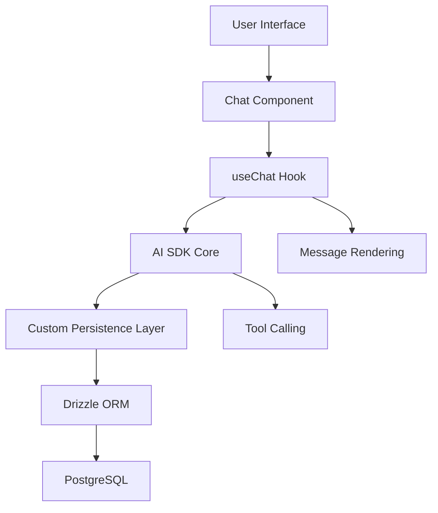
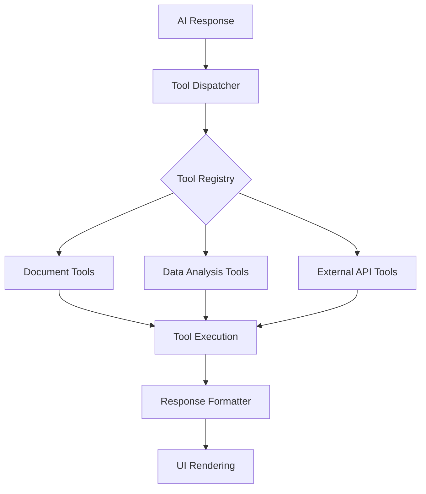
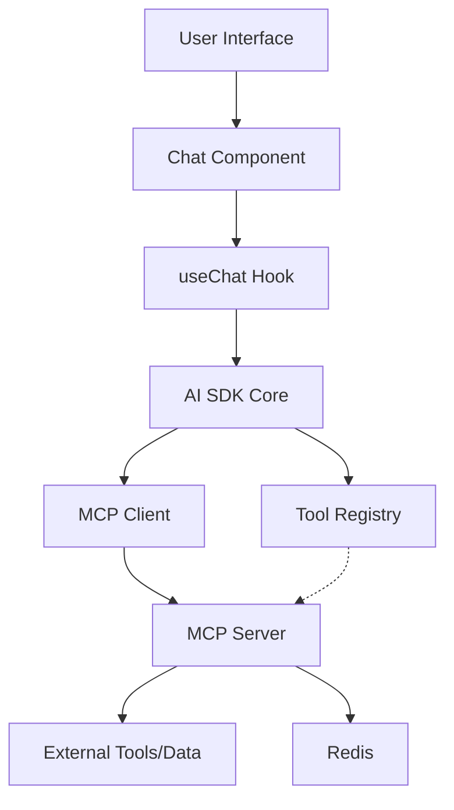

# AI Chatbot Technical Analysis

## Current Tech Stack Overview

This AI Chatbot is built on a modern JavaScript/TypeScript stack centered around Next.js and the Vercel AI SDK. The primary technologies include:

- **Next.js 14+**: App Router architecture for powerful server-side rendering and routing capabilities
- **React 19**: Server Components (RSCs) for optimized rendering and improved performance
- **TypeScript**: Type safety throughout the codebase
- **Vercel AI SDK**: Core integration layer for AI models with unified API for text generation and tool calls
- **Multiple LLM Providers**: xAI (default), OpenAI, Groq, with support for additional providers
- **PostgreSQL/Drizzle ORM**: Data persistence layer via Vercel Postgres (Neon) for storing chats, messages, and user data
- **Vercel Blob Storage**: File storage for artifacts and attachments
- **NextAuth.js**: Authentication framework for user management
- **shadcn/ui/Radix UI**: Component library and primitives for accessible UI elements
- **Tailwind CSS**: Utility-first styling approach
- **CodeMirror**: Code editor integration for code-related features
- **Playwright**: End-to-end testing framework

The architecture leverages modern web development patterns with a focus on server-side rendering, AI integration, and a responsive user interface.

## Detailed System Architecture

The application follows a layered architecture organized around the Next.js App Router:

### Routing Layer
- **App Router Pattern**: Leverages the Next.js App Router for file-based routing
- **Server Components**: Utilizes React Server Components for improved performance and reduced client-side JavaScript
- **Page Structure**: Organized into main sections like authentication (`(auth)`) and chat interface (`(chat)`)

### AI Integration Layer
- **AI SDK Integration**: Centralizes AI model access through the Vercel AI SDK
- **Provider Abstraction**: Implementation in `lib/ai/providers.ts` offers a unified interface to multiple LLM providers
- **Model Selection**: Dynamic model selection through the `models.ts` configuration
- **Prompt Management**: Systematic prompt engineering in `prompts.ts` for different interaction types
- **Tool Calling**: Implementation of AI function calling through tool definitions in `lib/ai/tools/`
  - Current tools include document creation/updates, weather information, and suggestions

### Data Persistence Layer
- **Schema Design**: Defined in `lib/db/schema.ts` using Drizzle ORM with tables for users, chats, messages, and artifacts
- **Query Handlers**: Database operations encapsulated in `lib/db/queries.ts`
- **Migration Support**: Migration utilities for schema updates
- **Message Structure**: Evolved from flat content to structured message parts for enhanced functionality

### Authentication Layer
- **NextAuth Integration**: Implements secure authentication flows
- **Session Management**: Persists user sessions and links them with generated content
- **Access Control**: Permissions and visibility controls for chat interactions

### UI Component Layer
- **Component Architecture**: Rich component ecosystem for chat interface, artifacts, and document editing
- **Chat Interface**: Implemented in `components/chat.tsx` using AI SDK React hooks
- **Message Rendering**: Structured message display with support for multiple content types
- **Artifact System**: Document creation and editing capabilities through specialized UI components

### Testing Architecture
- **End-to-End Testing**: Playwright tests organized by feature domains
- **Test Setup**: Separate setup files for authentication and reasoning capabilities
- **CI Integration**: GitHub Actions workflow for automated testing

## File Structure Analysis

The repository follows a typical Next.js App Router structure with clear separation of concerns:

```
├── app/                       # Next.js App Router pages and layouts
│   ├── (auth)/                # Authentication routes
│   ├── (chat)/                # Chat interface routes
│   └── layout.tsx             # Root layout component
├── components/                # React components
│   ├── ui/                    # Base UI components (shadcn/ui)
│   ├── chat.tsx               # Main chat component
│   ├── message.tsx            # Message rendering
│   └── artifact.tsx           # Artifact handling
├── lib/                       # Core functionality
│   ├── ai/                    # AI integration
│   │   ├── tools/             # Tool definitions for function calling
│   │   ├── models.ts          # AI model definitions
│   │   ├── providers.ts       # AI provider configuration
│   │   └── prompts.ts         # System prompts
│   ├── artifacts/             # Artifact implementation
│   ├── db/                    # Database operations
│   │   ├── migrations/        # Schema migrations
│   │   ├── schema.ts          # Database schema
│   │   └── queries.ts         # Database queries
│   └── utils.ts               # Utility functions
├── docs/                      # Documentation
├── public/                    # Static assets
└── tests/                     # Playwright tests
```

Key architectural patterns include:
- **Feature-based organization**: Components and functionality grouped by feature
- **Separation of client/server concerns**: Clear boundaries between server and client code
- **API Routes**: Next.js API routes for backend functionality
- **Tool-based AI integration**: Structured approach to AI function calling

## Proposed Tech Stack and Functional Enhancements

### Message Persistence Enhancement

The codebase currently implements a basic message storage system but lacks full integration with the AI SDK's message persistence capabilities. We propose:

1. **AI SDK Persistence Integration**: Leveraging the AI SDK's built-in message persistence to enable:
   - Reliable message storage with retry mechanisms
   - Automatic handling of long-running conversations
   - Support for conversation context management

2. **Implementation Approach**:
   - Extend the current database schema to align with AI SDK's message format
   - Implement custom persistence adapter using the AI SDK persistence API
   - Add message versioning support for tracking conversation history



### Tool Calling Mechanism Enhancement

The current implementation has basic tool calling capabilities but can be enhanced for better flexibility and extensibility:

1. **Structured Tool Registry**:
   - Implement a centralized tool registry system
   - Support for dynamic tool loading and discovery
   - Validation and type safety for tool definitions

2. **Tool Response Handling**:
   - Enhanced error handling for tool execution
   - Streaming support for long-running tool operations
   - Better UI feedback during tool execution

3. **Implementation Approach**:
   - Refactor the existing tools directory into a more modular structure
   - Create a tool registration system with metadata
   - Improve the UI components for displaying tool invocations and results



### AI SDK CORE Compliance

To ensure full compliance with the AI SDK CORE standards:

1. **Integration Updates**:
   - Upgrade to the latest AI SDK version
   - Implement all required interfaces for proper SDK integration
   - Ensure correct usage of SDK hooks and components

2. **Model Configuration**:
   - Standardize model configuration using AI SDK patterns
   - Support for model switching with preserved conversation context
   - Implement model-specific prompting strategies

3. **Implementation Approach**:
   - Refactor `providers.ts` to use the AI SDK's provider architecture
   - Update chat components to use AI SDK's latest patterns
   - Ensure proper typing throughout the AI integration layer

## Abstraction Layer Proposal

To decouple AI function-calling mechanisms from business logic:

1. **Core Abstraction Layer**:
   - Create a unified interface for all AI interactions
   - Abstract provider-specific implementations
   - Provide a pluggable architecture for tools and capabilities

```typescript
// Proposed abstraction interface
interface AIServiceInterface {
  // Core message handling
  sendMessage(message: string, options?: MessageOptions): Promise<AIResponse>;
  
  // Tool registration and management
  registerTool(tool: Tool): void;
  unregisterTool(toolId: string): void;
  
  // Context and state management
  getConversationContext(conversationId: string): Promise<Context>;
  setConversationContext(conversationId: string, context: Context): Promise<void>;
}
```

2. **Tool Abstraction**:
   - Define a standard tool interface with lifecycle hooks
   - Support for tool categorization and discovery
   - Allow for tool composition and dependencies

```typescript
// Proposed tool interface
interface Tool {
  id: string;
  name: string;
  description: string;
  category: ToolCategory;
  parameters: ToolParameter[];
  execute(params: Record<string, any>, context: ToolContext): Promise<ToolResult>;
  canHandle(intent: string): boolean;
}
```

3. **UI Abstraction**:
   - Decouple UI components from specific AI implementations
   - Create render adapters for different response types
   - Standardize interaction patterns for all AI features

This abstraction approach will:
- Enable easier integration of new AI providers
- Facilitate the addition of new tools without changing core logic
- Support future platform changes with minimal refactoring
- Allow for better testing and validation of AI interactions

## Suggested Refactoring Plan and Steps

### Phase 1: Core Architecture Enhancements

1. **Update AI SDK Integration**:
   - Upgrade to the latest AI SDK version
   - Refactor provider configuration
   - Implement AI SDK CORE compliance

2. **Enhance Message Structure**:
   - Complete migration to parts-based message structure
   - Implement proper handling for all message part types
   - Add support for advanced message features

3. **Improve Error Handling**:
   - Implement robust error handling for AI interactions
   - Add retry mechanisms for failed requests
   - Enhance user feedback for error states

### Phase 2: Tool System Refactoring

1. **Create Tool Registry**:
   - Implement centralized tool management
   - Add tool discovery and validation
   - Create standard interfaces for all tools

2. **Refactor Existing Tools**:
   - Convert current tools to new abstraction
   - Enhance tool documentation
   - Improve testing coverage for tools

3. **Add Tool Categories**:
   - Organize tools into logical categories
   - Implement UI for tool discovery
   - Add context-aware tool suggestions

### Phase 3: UI and UX Improvements

1. **Refactor Chat Components**:
   - Decouple from specific AI implementations
   - Improve rendering performance
   - Enhance accessibility

2. **Enhance Artifact System**:
   - Implement better artifact state management
   - Add support for more artifact types
   - Improve artifact sharing and export

3. **Optimize Performance**:
   - Implement better caching strategies
   - Reduce client-side JavaScript
   - Optimize database queries

### Phase 4: Testing and Documentation

1. **Expand Test Coverage**:
   - Add unit tests for core components
   - Enhance end-to-end test scenarios
   - Implement performance testing

2. **Improve Documentation**:
   - Document abstraction interfaces
   - Create usage examples
   - Add architecture diagrams

3. **Add Developer Tools**:
   - Implement debugging utilities
   - Add monitoring and logging
   - Create developer documentation

This phased approach ensures:
- Minimal disruption to existing functionality
- Incremental improvements that can be validated
- Clear separation of concerns throughout the refactoring
- Focus on maintainability and extensibility

## MCP Integration Plan

### Overview of Model Context Protocol (MCP)

The Model Context Protocol (MCP) is an open standard that enables seamless integration between AI applications and external data sources or tools. It provides a standardized way for LLMs to connect with and retrieve information from various systems, allowing AI to access real-time data rather than relying solely on its pre-trained knowledge.

Key features of MCP include:
- Standardized protocol for AI-data source communication
- Support for tools and function-calling capabilities
- Real-time data access and context management
- Ability to connect to multiple systems through a single interface

The vercel-labs/mcp-on-vercel repository provides a framework for running an MCP server on Vercel's infrastructure, which can complement our existing AI chatbot by enhancing its ability to access external data and tools.

### Integration Benefits

Integrating MCP into our current AI chatbot will provide several benefits:

1. **Enhanced Context Awareness**: Enable the chatbot to access real-time data and maintain context across multiple interactions.
2. **Expanded Tool Capabilities**: Introduce a standardized approach to tool calling beyond our current implementation.
3. **Improved Data Connectivity**: Allow the chatbot to connect with a wider range of data sources through a unified protocol.
4. **Standardization**: Align with emerging industry standards for AI context management.
5. **Future-Proofing**: Position the chatbot to adopt new data sources and tools as they become available through the MCP ecosystem.

### Technical Requirements

To integrate MCP with our existing AI chatbot, we'll need:

1. **Redis Instance**: MCP on Vercel requires a Redis database for state management (`process.env.REDIS_URL`).
2. **Fluid Compute**: Enable Vercel's Fluid Compute for efficient MCP server execution.
3. **TypeScript SDK Dependencies**: Add the MCP TypeScript SDK and related dependencies to our project.
4. **API Routes**: Create necessary API routes to handle MCP server connections.
5. **Client Integration**: Modify the chat interface to leverage MCP capabilities.

### Integration Architecture



### Implementation Plan

#### Phase 1: Setup MCP Server (2 weeks)

1. **Create MCP Server Directory**:
   - Add a new directory structure `/lib/mcp` to house the MCP server components
   - Initialize the MCP server configuration

2. **Configure Redis**:
   - Set up Redis instance on Vercel
   - Configure environment variables for Redis connection

3. **Implement Basic MCP Server**:
   - Create `/api/mcp/server.ts` endpoint for MCP server
   - Configure basic tools and prompts

4. **Setup Vercel Configuration**:
   - Update `vercel.json` to support longer function execution times
   - Enable Fluid Compute for the MCP server endpoint

#### Phase 2: Create MCP Client (2 weeks)

1. **Implement MCP Client**:
   - Create `/lib/mcp/client.ts` for MCP client implementation
   - Develop integration layer between AI SDK and MCP

2. **Develop Tool Registry**:
   - Create a centralized registry for MCP tools
   - Implement tool discovery and validation mechanisms

3. **Create Context Management**:
   - Implement context tracking between chat interactions
   - Develop persistence layer for conversation state

4. **Testing Infrastructure**:
   - Create test harness for MCP client-server communication
   - Develop integration tests for MCP functionality

#### Phase 3: UI Integration (2 weeks)

1. **Enhance Chat Components**:
   - Modify `/components/chat.tsx` to support MCP-powered interactions
   - Implement UI for displaying MCP tool usage

2. **Develop Message Components**:
   - Update `/components/message.tsx` to display MCP-related content
   - Create components for visualizing tool invocations and results

3. **Add Context Controls**:
   - Implement UI controls for managing conversation context
   - Create visualization for active data sources

4. **Testing and Refinement**:
   - Perform end-to-end testing of the integrated chat experience
   - Refine UI based on user feedback

#### Phase 4: Tool Development (Ongoing)

1. **Implement Core Tools**:
   - Document search and retrieval
   - Data visualization tools
   - Knowledge base integration

2. **Create Custom Tools**:
   - Domain-specific tools based on business requirements
   - Integration with internal systems

3. **Documentation**:
   - Create developer documentation for extending MCP tools
   - Develop user documentation for utilizing MCP capabilities

### Required Changes to Existing Codebase

1. **Package Dependencies**:
   Add the following to `package.json`:
   ```json
   {
     "dependencies": {
       "@mcp/typescript-sdk": "latest",
       "ioredis": "^5.3.2"
     }
   }
   ```

2. **Environment Variables**:
   Add to `.env` and `.env.example`:
   ```
   REDIS_URL=redis://...
   MCP_SERVER_URL=https://...
   ```

3. **AI SDK Integration**:
   Modify `/lib/ai/providers.ts` to include MCP capabilities:
   ```typescript
   import { createMCPClient } from '@/lib/mcp/client';

   // Add MCP integration to existing AI provider
   export const myProvider = isTestEnvironment
     ? // existing test configuration
     : customProvider({
         languageModels: {
           // existing models
         },
         // Add MCP context provider
         contextProvider: createMCPClient({
           serverUrl: process.env.MCP_SERVER_URL,
         }),
       });
   ```

### Challenges and Considerations

1. **Performance**: MCP communication adds additional network requests that may impact response times. Implement caching strategies to mitigate latency.

2. **Security**: MCP provides access to external systems, requiring careful security considerations:
   - Implement proper authentication and authorization
   - Limit tool access based on user permissions
   - Sanitize inputs and outputs to prevent injection attacks

3. **Error Handling**: MCP interactions may fail due to external dependencies:
   - Implement robust error handling and fallback mechanisms
   - Provide clear feedback to users when tools are unavailable
   - Monitor and log MCP-related errors for debugging

4. **Testing**: MCP integration increases the complexity of testing:
   - Create mock MCP servers for testing
   - Develop isolated test environments for each tool
   - Implement comprehensive integration testing

### Success Criteria

The MCP integration will be considered successful when:

1. The chatbot can seamlessly access external data sources through MCP
2. Users can utilize MCP-powered tools through the chat interface
3. Context is maintained effectively across conversation sessions
4. Response quality and relevance are improved through MCP-provided context
5. New tools can be added with minimal development effort

### Conclusion

Integrating the Model Context Protocol (MCP) into our existing AI chatbot represents a significant enhancement to its capabilities. By following the phased approach outlined above, we can gradually introduce MCP functionality while minimizing disruption to the existing user experience.

The MCP integration aligns well with our existing abstraction layer proposal and will complement the planned refactoring efforts. The resulting system will be more flexible, extensible, and capable of delivering higher-quality AI interactions through improved context awareness and tool capabilities.
