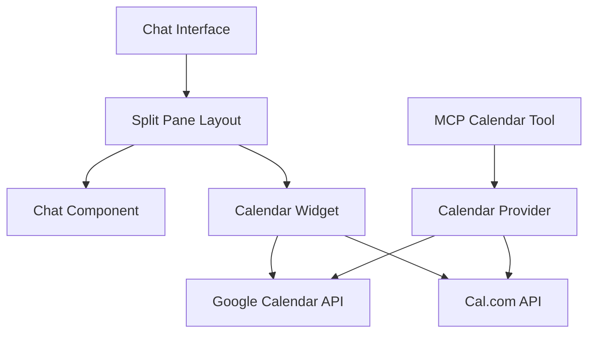

# Calendar Integration Strategy

## Overview

This document outlines the implementation strategy for adding calendar scheduling functionality to our AI chatbot application using MCP (Model Context Protocol) and NextJS best practices.

## Table of Contents
1. [Architecture](#architecture)
2. [MCP Tool Implementation](#mcp-tool-implementation)
3. [UI Components](#ui-components)
4. [Database Schema](#database-schema)
5. [Authentication & Authorization](#authentication--authorization)
6. [Implementation Phases](#implementation-phases)

## Architecture

### Component Structure


### Directory Structure
```
lib/
  ├── calendar/
  │   ├── providers/
  │   │   ├── base.ts
  │   │   ├── google.ts
  │   │   └── cal-com.ts
  │   └── types.ts
  ├── mcp/
  │   └── tools/
  │       └── calendar.ts
components/
  ├── layout/
  │   └── SplitPane.tsx
  └── calendar/
      ├── CalendarWidget.tsx
      ├── TimeSlotPicker.tsx
      └── AppointmentForm.tsx
```

## MCP Tool Implementation

### Calendar Tool Definition
```typescript
// lib/mcp/tools/calendar.ts
import { z } from 'zod';
import { McpServer } from '@modelcontextprotocol/sdk/server/mcp.js';

const scheduleAppointmentSchema = {
  date: z.string(),
  time: z.string(),
  duration: z.number(),
  customerName: z.string(),
  customerEmail: z.string(),
  appointmentType: z.string(),
  organizationId: z.string()
};

export function registerCalendarTools(server: McpServer) {
  // Schedule Appointment Tool
  server.tool(
    "scheduleAppointment",
    scheduleAppointmentSchema,
    async (args) => {
      const appointment = await createAppointment(args);
      return {
        content: [{
          type: "text",
          text: `Appointment scheduled for ${args.date} at ${args.time}`
        }]
      };
    }
  );

  // Get Available Slots Tool
  server.tool(
    "getAvailableSlots",
    {
      date: z.string(),
      organizationId: z.string(),
      duration: z.number().optional()
    },
    async ({ date, organizationId, duration }) => {
      const slots = await fetchAvailableSlots(organizationId, date, duration);
      return {
        content: [{
          type: "text",
          text: JSON.stringify(slots)
        }]
      };
    }
  );
}
```

## UI Components

### Split Pane Layout
```typescript
// components/layout/SplitPane.tsx
interface SplitPaneProps {
  chatComponent: React.ReactNode;
  calendarComponent: React.ReactNode;
  isCalendarVisible: boolean;
}

export function SplitPane({
  chatComponent,
  calendarComponent,
  isCalendarVisible
}: SplitPaneProps) {
  return (
    <div className="flex w-full h-screen">
      <div className={cn(
        "transition-all duration-300",
        isCalendarVisible ? "w-1/2" : "w-full"
      )}>
        {chatComponent}
      </div>
      {isCalendarVisible && (
        <div className="w-1/2 border-l border-gray-200">
          {calendarComponent}
        </div>
      )}
    </div>
  );
}
```

## Database Schema

### Core Tables
```sql
-- Organizations table
CREATE TABLE organizations (
  id UUID PRIMARY KEY DEFAULT uuid_generate_v4(),
  name VARCHAR(255) NOT NULL,
  calendar_provider VARCHAR(50) NOT NULL,
  calendar_settings JSONB,
  created_at TIMESTAMP WITH TIME ZONE DEFAULT NOW(),
  updated_at TIMESTAMP WITH TIME ZONE DEFAULT NOW()
);

-- Appointments table
CREATE TABLE appointments (
  id UUID PRIMARY KEY DEFAULT uuid_generate_v4(),
  organization_id UUID REFERENCES organizations(id),
  customer_id UUID NOT NULL,
  start_time TIMESTAMP WITH TIME ZONE NOT NULL,
  end_time TIMESTAMP WITH TIME ZONE NOT NULL,
  status VARCHAR(50) NOT NULL,
  appointment_type VARCHAR(100) NOT NULL,
  metadata JSONB,
  created_at TIMESTAMP WITH TIME ZONE DEFAULT NOW(),
  updated_at TIMESTAMP WITH TIME ZONE DEFAULT NOW()
);

-- Calendar availability table
CREATE TABLE calendar_availability (
  id UUID PRIMARY KEY DEFAULT uuid_generate_v4(),
  organization_id UUID REFERENCES organizations(id),
  day_of_week INTEGER NOT NULL,
  start_time TIME NOT NULL,
  end_time TIME NOT NULL,
  created_at TIMESTAMP WITH TIME ZONE DEFAULT NOW()
);
```

## Authentication & Authorization

### Organization Setup
1. OAuth2 Configuration
   - Set up OAuth2 credentials for Google Calendar
   - Store encrypted credentials in environment variables
   - Implement token refresh mechanism

2. Role-Based Access Control
   ```typescript
   enum UserRole {
     ADMIN = 'admin',
     CUSTOMER = 'customer',
     GUEST = 'guest'
   }
   
   interface CalendarPermissions {
     canView: boolean;
     canSchedule: boolean;
     canModify: boolean;
     canCancel: boolean;
   }
   ```

## Implementation Phases

### Phase 1: Core Infrastructure (1 week)
- [ ] Set up database schema
- [ ] Implement calendar provider interfaces
- [ ] Create MCP calendar tools
- [ ] Configure OAuth2 for Google Calendar

### Phase 2: UI Components (1 week)
- [ ] Build split pane layout
- [ ] Create calendar widget
- [ ] Implement time slot picker
- [ ] Design appointment form

### Phase 3: Integration (1 week)
- [ ] Connect MCP tools with providers
- [ ] Implement authentication flows
- [ ] Add real-time updates
- [ ] Set up webhooks for calendar sync

### Phase 4: Testing & Refinement (1 week)
- [ ] Write end-to-end tests
- [ ] Perform security audit
- [ ] Optimize performance
- [ ] Conduct user testing

## Error Handling

### Common Error Scenarios
1. Calendar API failures
2. Double booking attempts
3. Authentication errors
4. Network timeouts

### Error Response Structure
```typescript
interface CalendarError {
  code: string;
  message: string;
  details?: Record<string, any>;
  retry?: boolean;
}
```

## Monitoring & Analytics

### Key Metrics
1. Booking success rate
2. API response times
3. Calendar sync status
4. Error frequency

### Logging Strategy
```typescript
interface CalendarEventLog {
  eventType: 'SCHEDULE' | 'CANCEL' | 'MODIFY';
  organizationId: string;
  customerId: string;
  timestamp: Date;
  status: 'SUCCESS' | 'FAILURE';
  details: Record<string, any>;
}
```

## Future Enhancements

### Phase 5: Advanced Features
- [ ] Recurring appointments
- [ ] Multi-timezone support
- [ ] Waitlist management
- [ ] SMS notifications
- [ ] Calendar analytics dashboard

### Phase 6: Integration Expansion
- [ ] Additional calendar providers
- [ ] CRM integration
- [ ] Custom notification templates
- [ ] Mobile app support

## Resources & Dependencies

### Required Packages
```json
{
  "dependencies": {
    "@google-cloud/calendar": "^3.0.0",
    "@cal.com/api": "^1.0.0",
    "date-fns": "^2.30.0",
    "date-fns-tz": "^2.0.0",
    "zod": "^3.22.0"
  }
}
```

### Documentation Links
- [Google Calendar API](https://developers.google.com/calendar)
- [Cal.com API](https://cal.com/docs/api)
- [NextAuth.js](https://next-auth.js.org)
- [MCP TypeScript SDK](https://modelcontextprotocol.io) 